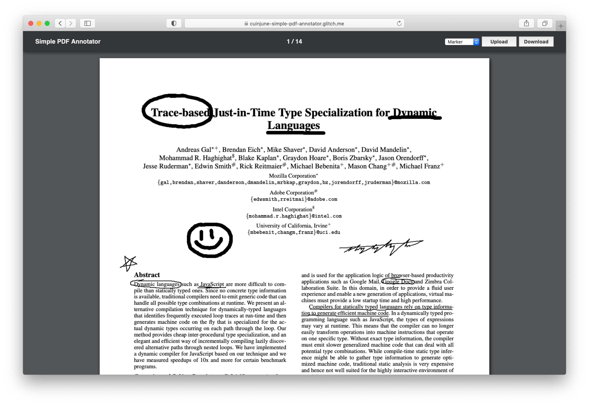

# Simple PDF Annotator


## Description

This repo is the week7 assignment of the "Hand Held: Creative Tools for Phones" course at ITP.  
The assignment was to build an application designed for drawing a specific thing on some sort of background texture / image.  
I decided to create a simple PDF annotation application that allows the user to upload, edit, and download a PDF document.

Here's the [Live Demo on Glitch](https://cuinjune-simple-pdf-annotator.glitch.me/).

## Setup

1. You need to have [Python](https://realpython.com/installing-python/) installed on your computer
2. Run the following commands in the Terminal
```
git clone https://github.com/cuinjune/simple-pdf-annotator.git
cd simple-pdf-annotator
python -m http.server 8080
```
3. Open your web browser and navigate to http://localhost:8080

## Author
* [Zack Lee](https://www.cuinjune.com/about): an MPS Candidate at [NYU ITP](https://itp.nyu.edu).
